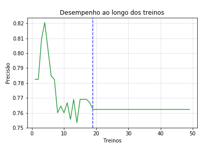

# Quanto mais complexo melhor?

 Este repositório surgiu após uma curiosidade de minha parte durante os estudo de machine learning. A grande questão foi quanto mais complexo um modelo de arvore de decisão melhor fica sua precisão? O mesmo acontece para modelos de árvore randômica? 

 Afim de validar a teoria selecionei o conjunto de dados referentes a tragédia do Titanic e com base nas características sociais e biológicas dos passageiros tentar prever sua possível morte ou sobrevivência ao incidente.

## Alguns spoilers.

### Grafico de evolução da árvore de descisão.

### Grafico de evolução da Floresta randômica.

 A resposta ao problema é que nem sempre mais complexo significa mais performance. Caso tenha curiosidade para descobrir como cheguei nesse resultando o código está disponível nesse Github em Jupyter notebook 

Ass: Victor Furim Poldauf

